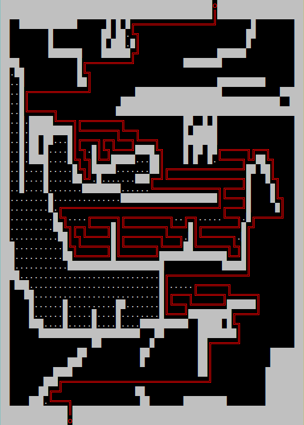

# Tiny-.BMP-Maze-Solver

Windows console app that uses DFS to exit a maze. The maze, which should be a 24-bit .bmp file, is inputted as a commandline argument (just drag and drop a maze image onto the .exe file).

